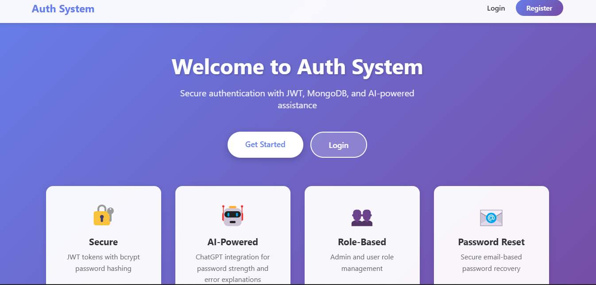

# Authentication System Project

A modern, secure authentication system built with Node.js, Express, MongoDB, React, and JWT tokens, featuring AI-powered password strength analysis and error explanations using ChatGPT.

## Features

- 🔐 **Secure Authentication**: JWT access & refresh tokens with bcrypt password hashing
- 🤖 **AI Integration**: ChatGPT-powered password strength feedback and authentication error explanations
- 👥 **Role-Based Access Control**: Admin and User roles with protected routes
- 📧 **Password Reset**: Secure email-based password recovery system
- 🎨 **Modern UI**: Beautiful, responsive React frontend with gradient design
- 🔒 **Security Best Practices**: Input validation, token invalidation, secure password handling

## Project Screenshot



## Tech Stack

### Backend

- Node.js with Express.js
- MongoDB with Mongoose
- JWT (jsonwebtoken)
- bcryptjs for password hashing
- OpenAI API (ChatGPT)
- Nodemailer for email services
- Express Validator for input validation

### Frontend

- React 18
- React Router DOM
- Axios for API calls
- Modern CSS with gradients and animations

## Project Structure

```
Authentication System Project/
├── backend/
│   ├── config/
│   │   └── database.js          # MongoDB connection
│   ├── middleware/
│   │   └── auth.js              # Authentication & authorization middleware
│   ├── models/
│   │   └── User.js              # User schema with Mongoose
│   ├── routes/
│   │   └── auth.js              # Authentication routes
│   ├── services/
│   │   ├── chatgptService.js    # ChatGPT integration
│   │   └── emailService.js      # Email service
│   ├── utils/
│   │   └── generateTokens.js    # JWT token generation
│   ├── .env.example             # Environment variables template
│   ├── .gitignore
│   ├── package.json
│   └── server.js                # Express server
│
├── frontend/
│   ├── public/
│   │   └── index.html
│   ├── src/
│   │   ├── components/
│   │   │   ├── FormCard.js      # Reusable form card component
│   │   │   ├── Navbar.js        # Navigation bar
│   │   │   └── PrivateRoute.js  # Protected route wrapper
│   │   ├── context/
│   │   │   └── AuthContext.js   # Authentication context
│   │   ├── pages/
│   │   │   ├── Home.js          # Landing page
│   │   │   ├── Login.js         # Login page
│   │   │   ├── Register.js      # Registration page
│   │   │   ├── Profile.js       # User profile page
│   │   │   ├── ForgotPassword.js
│   │   │   └── ResetPassword.js
│   │   ├── App.js
│   │   ├── App.css
│   │   ├── index.js
│   │   └── index.css
│   ├── .env.example
│   ├── .gitignore
│   └── package.json
│
└── README.md
```

## Setup Instructions

### Prerequisites

- Node.js (v14 or higher)
- MongoDB (local installation or MongoDB Atlas account)
- OpenAI API key (for ChatGPT features)
- Email account for password reset (Gmail recommended)

### Backend Setup

1. Navigate to the backend directory:

```bash
cd backend
```

2. Install dependencies:

```bash
npm install
```

3. Create a `.env` file based on `.env.example`:

```bash
cp .env.example .env
```

4. Configure your `.env` file:

```env
PORT=5000
NODE_ENV=development
MONGODB_URI=mongodb://localhost:27017/auth-system
JWT_SECRET=your-super-secret-jwt-key-change-this-in-production
JWT_REFRESH_SECRET=your-super-secret-refresh-jwt-key-change-this-in-production
ACCESS_TOKEN_EXPIRE=15m
REFRESH_TOKEN_EXPIRE=7d
OPENAI_API_KEY=your-openai-api-key-here
EMAIL_HOST=smtp.gmail.com
EMAIL_PORT=587
EMAIL_USER=your-email@gmail.com
EMAIL_PASS=your-app-specific-password
FRONTEND_URL=http://localhost:3000
CLIENT_URL=http://localhost:3000
```

5. Start MongoDB (if running locally):

```bash
# On Windows
net start MongoDB

# On macOS/Linux
sudo systemctl start mongod
```

6. Run the backend server:

```bash
# Development mode with nodemon
npm run dev

# Production mode
npm start
```

The backend server will run on `http://localhost:5000`

### Frontend Setup

1. Navigate to the frontend directory:

```bash
cd frontend
```

2. Install dependencies:

```bash
npm install
```

3. Create a `.env` file based on `.env.example`:

```bash
cp .env.example .env
```

4. Configure your `.env` file:

```env
REACT_APP_API_URL=http://localhost:5000/api
```

5. Start the React development server:

```bash
npm start
```

The frontend will run on `http://localhost:3000`

## API Documentation

### Base URL

```
http://localhost:5000/api
```

### Postman Collection Setup

For Postman testing, use these full URLs. Make sure your backend server is running on port 5000.

**Note**: For protected routes (marked as Private), you need to:

1. First login or register to get an access token
2. Copy the `accessToken` from the response
3. Add it to the request headers: `Authorization: Bearer <access_token>`

### Endpoints

#### 1. Register User

- **Method**: `POST`
- **URL**: `http://localhost:5000/api/auth/register`
- **Access**: Public
- **Body:**
  ```json
  {
    "name": "John Doe",
    "email": "john@example.com",
    "password": "password123"
  }
  ```
- **Response:**
  ```json
  {
    "success": true,
    "data": {
      "user": {
        "id": "user_id",
        "name": "John Doe",
        "email": "john@example.com",
        "role": "user"
      },
      "accessToken": "jwt_access_token",
      "refreshToken": "jwt_refresh_token",
      "passwordFeedback": {
        "strength": "moderate",
        "score": 65,
        "feedback": "Your password is moderately strong...",
        "suggestions": ["Add special characters", "Use longer password"]
      }
    },
    "message": "User registered successfully"
  }
  ```

#### 2. Login

- **Method**: `POST`
- **URL**: `http://localhost:5000/api/auth/login`
- **Access**: Public
- **Body:**
  ```json
  {
    "email": "john@example.com",
    "password": "password123"
  }
  ```
- **Response:**
  ```json
  {
    "success": true,
    "data": {
      "user": { ... },
      "accessToken": "jwt_access_token",
      "refreshToken": "jwt_refresh_token"
    },
    "message": "Login successful"
  }
  ```
- **Error Response (with AI explanation):**
  ```json
  {
    "success": false,
    "message": "Invalid credentials",
    "errorExplanation": {
      "explanation": "The email or password you entered is incorrect",
      "cause": "User not found or incorrect password",
      "solution": "Please check your credentials and try again",
      "prevention": "Double-check your email and password before submitting"
    }
  }
  ```

#### 3. Refresh Token

- **Method**: `POST`
- **URL**: `http://localhost:5000/api/auth/refresh`
- **Access**: Public
- **Body:**
  ```json
  {
    "refreshToken": "jwt_refresh_token"
  }
  ```
- **Response:**
  ```json
  {
    "success": true,
    "data": {
      "accessToken": "new_jwt_access_token"
    },
    "message": "Token refreshed successfully"
  }
  ```

#### 4. Get Profile

- **Method**: `GET`
- **URL**: `http://localhost:5000/api/auth/profile`
- **Access**: Private (requires Bearer token)
- **Headers:**
  ```
  Authorization: Bearer <access_token>
  ```
- **Response:**
  ```json
  {
    "success": true,
    "data": {
      "user": {
        "id": "user_id",
        "name": "John Doe",
        "email": "john@example.com",
        "role": "user"
      }
    }
  }
  ```

#### 5. Logout

- **Method**: `POST`
- **URL**: `http://localhost:5000/api/auth/logout`
- **Access**: Private (requires Bearer token)
- **Headers:**
  ```
  Authorization: Bearer <access_token>
  ```
- **Body:**
  ```json
  {
    "refreshToken": "jwt_refresh_token"
  }
  ```
- **Response:**
  ```json
  {
    "success": true,
    "message": "Logged out successfully"
  }
  ```

#### 6. Forgot Password

- **Method**: `POST`
- **URL**: `http://localhost:5000/api/auth/forgot-password`
- **Access**: Public
- **Body:**
  ```json
  {
    "email": "john@example.com"
  }
  ```
- **Response:**
  ```json
  {
    "success": true,
    "message": "Password reset email sent"
  }
  ```

#### 7. Reset Password

- **Method**: `POST`
- **URL**: `http://localhost:5000/api/auth/reset-password`
- **Access**: Public
- **Body:**
  ```json
  {
    "token": "reset_token_from_email",
    "password": "newpassword123"
  }
  ```
- **Response:**
  ```json
  {
    "success": true,
    "message": "Password reset successful"
  }
  ```

#### 8. Get All Users (Admin Only)

- **Method**: `GET`
- **URL**: `http://localhost:5000/api/auth/admin/users`
- **Access**: Private/Admin (requires Bearer token and admin role)
- **Headers:**
  ```
  Authorization: Bearer <admin_access_token>
  ```
- **Response:**
  ```json
  {
    "success": true,
    "count": 2,
    "data": [
      {
        "id": "user_id_1",
        "name": "John Doe",
        "email": "john@example.com",
        "role": "user"
      },
      ...
    ]
  }
  ```

#### 9. Assign/Change User Role (Admin Only)

- **Method**: `PATCH`
- **URL**: `http://localhost:5000/api/auth/admin/assign-role`
- **Access**: Private/Admin (requires Bearer token and admin role)
- **Headers:**
  ```
  Authorization: Bearer <admin_access_token>
  Content-Type: application/json
  ```
- **Body:**
  ```json
  {
    "userId": "user_id_here",
    "role": "admin"
  }
  ```
- **Response:**
  ```json
  {
    "success": true,
    "data": {
      "_id": "user_id",
      "name": "John Doe",
      "email": "john@example.com",
      "role": "admin",
      "createdAt": "2024-01-01T00:00:00.000Z",
      "updatedAt": "2024-01-01T00:00:00.000Z"
    },
    "message": "User role updated to admin"
  }
  ```
- **Error Response:**
  ```json
  {
    "success": false,
    "message": "User not found"
  }
  ```

### Postman Testing Guide

#### Step-by-Step Testing Instructions

1. **Start the Backend Server**

   ```bash
   cd backend
   npm run dev
   ```

2. **Register a User**

   - Method: `POST`
   - URL: `http://localhost:5000/api/auth/register`
   - Body (raw JSON):
     ```json
     {
       "name": "Test User",
       "email": "test@example.com",
       "password": "password123"
     }
     ```
   - Save the `accessToken` and `refreshToken` from the response

3. **Login**

   - Method: `POST`
   - URL: `http://localhost:5000/api/auth/login`
   - Body (raw JSON):
     ```json
     {
       "email": "test@example.com",
       "password": "password123"
     }
     ```

4. **Get Profile (Protected Route)**

   - Method: `GET`
   - URL: `http://localhost:5000/api/auth/profile`
   - Headers:
     - Key: `Authorization`
     - Value: `Bearer <access_token_from_step_2_or_3>`

5. **Create Admin User (Using MongoDB)**

   - Use MongoDB Compass or shell to update a user's role to "admin"
   - Or use the script: `node backend/scripts/createAdmin.js admin@example.com`

6. **Login as Admin**

   - Method: `POST`
   - URL: `http://localhost:5000/api/auth/login`
   - Body (raw JSON):
     ```json
     {
       "email": "admin@example.com",
       "password": "admin_password"
     }
     ```
   - Save the admin `accessToken`

7. **Get All Users (Admin Only)**

   - Method: `GET`
   - URL: `http://localhost:5000/api/auth/admin/users`
   - Headers:
     - Key: `Authorization`
     - Value: `Bearer <admin_access_token>`

8. **Change User Role (Admin Only)**
   - Method: `PATCH`
   - URL: `http://localhost:5000/api/auth/admin/assign-role`
   - Headers:
     - Key: `Authorization`
     - Value: `Bearer <admin_access_token>`
     - Key: `Content-Type`
     - Value: `application/json`
   - Body (raw JSON):
     ```json
     {
       "userId": "user_id_to_change",
       "role": "admin"
     }
     ```

#### Quick Postman Environment Setup

Create a Postman Environment with these variables:

```
base_url: http://localhost:5000/api
access_token: (leave empty, will be set after login)
refresh_token: (leave empty, will be set after login)
admin_access_token: (leave empty, will be set after admin login)
```

Then use `{{base_url}}/auth/login` as your URL, and `{{access_token}}` in your Authorization headers.

## Security Features

1. **Password Hashing**: All passwords are hashed using bcryptjs before storage
2. **JWT Tokens**: Secure access and refresh token mechanism
3. **Token Invalidation**: Refresh tokens are stored and can be invalidated on logout
4. **Input Validation**: Express-validator for request validation
5. **CORS**: Configured CORS for secure cross-origin requests
6. **Password Reset Security**: Time-limited, hashed tokens for password reset
7. **Role-Based Access**: Middleware for protecting routes based on user roles

### Verifying Admin Role

After assigning admin role, verify it by:

1. **Check user profile** (returns role):

```bash
GET /api/auth/profile
Authorization: Bearer <access_token>
```

2. **Test admin route** (should work if admin):

```bash
GET /api/auth/admin/users
Authorization: Bearer <admin_access_token>
```

### Role-Based Access Control

#### Protecting Routes by Role

Use the `authorize` middleware to restrict routes to specific roles:

```javascript
const { protect, authorize } = require("../middleware/auth");

// Admin only route
router.get("/admin/users", protect, authorize("admin"), async (req, res) => {
  // Only admins can access this
});

// Multiple roles
router.get(
  "/dashboard",
  protect,
  authorize("admin", "moderator"),
  async (req, res) => {
    // Admins and moderators can access
  }
);
```

#### Frontend Role Check

In React components:

```javascript
import { useAuth } from "../context/AuthContext";

const AdminPanel = () => {
  const { user } = useAuth();

  if (user?.role !== "admin") {
    return <div>Access Denied</div>;
  }

  return <div>Admin Panel Content</div>;
};
```

## ChatGPT Integration

### Password Strength Feedback

During registration, the system uses ChatGPT to analyze password strength and provide:

- Strength rating (weak/moderate/strong)
- Numerical score (0-100)
- Feedback message
- Improvement suggestions

### Error Explanations

When authentication errors occur, ChatGPT provides:

- User-friendly explanation
- Root cause analysis
- Step-by-step solution
- Prevention tips

## Email Configuration (Gmail)

To use Gmail for password reset emails:

1. Enable 2-Step Verification on your Google account
2. Generate an App Password:
   - Go to Google Account settings
   - Security → 2-Step Verification → App passwords
   - Generate a password for "Mail"
3. Use this app password in your `.env` file as `EMAIL_PASS`

## Environment Variables

### Backend (.env)

- `PORT`: Server port (default: 5000)
- `MONGODB_URI`: MongoDB connection string
- `JWT_SECRET`: Secret for access tokens
- `JWT_REFRESH_SECRET`: Secret for refresh tokens
- `OPENAI_API_KEY`: OpenAI API key for ChatGPT
- `EMAIL_HOST`: SMTP server host
- `EMAIL_PORT`: SMTP server port
- `EMAIL_USER`: Email username
- `EMAIL_PASS`: Email password/app password
- `FRONTEND_URL`: Frontend URL for reset links
- `CLIENT_URL`: CORS allowed origin

### Frontend (.env)

- `REACT_APP_API_URL`: Backend API URL

## Testing

### Manual Testing Checklist

1. **Registration**

   - [ ] Register with valid data
   - [ ] Check password strength feedback from ChatGPT
   - [ ] Try registering with existing email (should fail)
   - [ ] Try registering with invalid email format

2. **Login**

   - [ ] Login with correct credentials
   - [ ] Try login with incorrect password (check AI error explanation)
   - [ ] Try login with non-existent email (check AI error explanation)

3. **Token Refresh**

   - [ ] Use refresh token to get new access token
   - [ ] Try with invalid refresh token

4. **Protected Routes**

   - [ ] Access profile without token (should redirect)
   - [ ] Access profile with valid token (should work)

5. **Password Reset**

   - [ ] Request password reset
   - [ ] Check email for reset link
   - [ ] Reset password with valid token
   - [ ] Try with expired/invalid token

6. **Logout**
   - [ ] Logout and verify token is invalidated
   - [ ] Try accessing protected route after logout

## Deployment Notes

1. **Backend Deployment**

   - Set `NODE_ENV=production`
   - Use strong, random values for JWT secrets
   - Configure MongoDB Atlas or production MongoDB instance
   - Set up proper CORS origins
   - Use environment variables for all sensitive data

2. **Frontend Deployment**
   - Update `REACT_APP_API_URL` to production API URL
   - Build production bundle: `npm run build`
   - Deploy `build/` folder to hosting service (Netlify, Vercel, etc.)

## Troubleshooting

### Common Issues

1. **MongoDB Connection Error**

   - Ensure MongoDB is running
   - Check `MONGODB_URI` in `.env`
   - Verify MongoDB service is accessible

2. **ChatGPT API Errors**

   - Verify `OPENAI_API_KEY` is correct
   - Check API quota/limits
   - System will continue to work without ChatGPT (with default responses)

3. **Email Not Sending**

   - Verify email credentials
   - For Gmail, use App Password (not regular password)
   - Check SMTP settings

4. **CORS Errors**
   - Verify `CLIENT_URL` matches frontend URL
   - Check browser console for specific CORS error
